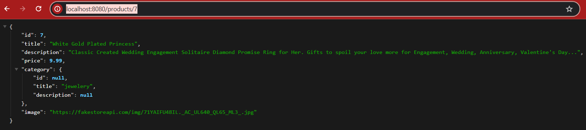

# Step-1 : Finished Product API

- Get all products
- Get a single product

#### http://localhost:8080/products/7

#### http://localhost:8080/products

# Step-2 : Exception Handling
Exception Handling is important because, 
- if we don't handle the exception then a LOT of INTERNAL DATA will be exposed to the client. This creates a serious Security Threat. 
- Moreover, it is not User-Friendly.

#### Topics Covered : 
- Runtime Exception through Controller Layer
- Runtime Exception through Service Layer
- Try Catch
- Response Entity
- Exception DTO
- Controller Advices [ Specific Exception && General Exception ]
- Custom Exceptions

#### Response Entity

We generally get multiple responses/Data from an API. If you want to return more data, we have a class called Response Entity.
  
Response Entity will have lot of things. 
- Response Body ( the object that you want to pass)
- Status Code (200, 404, 400)
- Headers

#### Status Codes
- HttpStatus.OK : 200
- HttpStatus.NOT_FOUND : 404
- HttpStatus.BAD_REQUEST : 400

#### Exception Handling through Controller using Response Entity

#### Response Entity Through Exception DTO

- While handling the Exception inside the controller we are writting a lot of code inside the controller. 
- This makes the controller Bulky.
- Controller should be as Light as Possible.
- There shouldn't be any Business Logic Inside the controller.
- Hence, here comes the Logic of Controller Advices.

#### Controller Advice  ( Censor Board )
- Special class by Spring FrameWork (Annotation)
- When the response is being returned by the Controller, before reaching to the client there is a final check called Controller Advice.
- Every response will be pass via Controller Advice.
- It is the final thing through which the Exception will pass before reaching to client.
- Additional check on whatever is being pass by controller to the client.
- In the controller Advice, we can modify the content that is being passed by the controller just before reaching to the client.

#### Exception Handling using Controller Advice

#### Custom Exception

